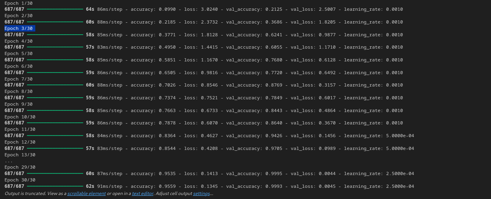
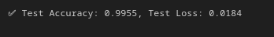
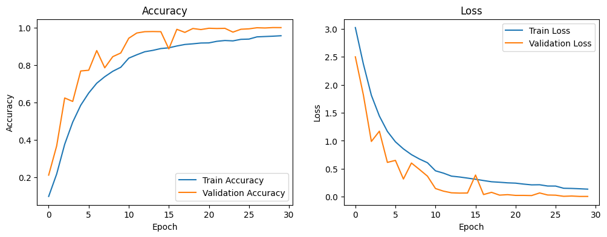

# Project Report: CNN for Hand Sign Recognition

**Prepared by:** Anouar Moudad  
**Requested by:** Ms. Asmae OUHMIDA

---

## Introduction

The project focuses on building a Convolutional Neural Network (CNN) to recognize hand signs from images. This report details the process, from data preparation to model evaluation.

## Objective

The primary objective is to develop a deep learning model using a CNN that can accurately predict and classify hand sign images into their respective categories.

## Dataset Used

**Source:** `ash2703/handsignimages` from Kaggle Hub

### Example Images:


---

## Data Analysis

### Image Dimensions and Batch Size

We use an image size of **32×32 pixels** and a batch size of **32**. This size is a compromise between computational efficiency and retaining sufficient image detail for the model to learn from.

### Data Augmentation

We use the following techniques to artificially expand the training dataset:
- `RandomFlip` - Horizontal flipping
- `RandomRotation` - Random rotation (±72°)
- `RandomZoom` - Random zoom (±20%)

This helps in preventing overfitting and improving the model's ability to generalize to unseen data.

### Data Loading

We use `tf.keras.utils.image_dataset_from_directory`, which is an efficient way to create a `tf.data.Dataset` from a directory of images.

## Data Optimization

We apply several optimization techniques:
- **`.cache()`** - Keeps images in memory after they're loaded off disk during the first epoch, preventing disk I/O bottlenecks
- **`.shuffle(1000)`** - Randomizes the order of images to prevent learning based on sequence
- **`.prefetch()`** - Overlaps data preprocessing and model execution while training for better performance

---

## CNN Model Architecture

The model is a sequential `tf.keras.Model` with the following structure:

### Convolutional Blocks:
- **Block 1:** 2× Conv2D(32 filters) + BatchNormalization + MaxPooling + Dropout(0.3)
- **Block 2:** 2× Conv2D(64 filters) + BatchNormalization + MaxPooling + Dropout(0.4)
- **Block 3:** 2× Conv2D(128 filters) + BatchNormalization + MaxPooling + Dropout(0.4)

### Classification Layers:
- **Flatten** - Converts 3D feature maps to 1D
- **Dense(256)** - Fully connected layer with ReLU activation
- **Dropout(0.5)** - Regularization
- **Dense(24)** - Output layer with Softmax activation (24 classes)

All convolutional layers use:
- **Activation:** ReLU
- **Padding:** Same (preserves spatial dimensions)
- **Filter size:** 3×3

---

## Model Compilation

The model is compiled with the following configuration:

- **Optimizer:** Adam (learning_rate=0.001)
- **Loss Function:** `sparse_categorical_crossentropy`
- **Metrics:** Accuracy

---

## Callbacks

Two callbacks are used to optimize training:

1. **EarlyStopping**
   - Monitors: `val_loss`
   - Patience: 5 epochs
   - Restores best weights when training stops
   - Purpose: Prevents overfitting and saves training time

2. **ReduceLROnPlateau**
   - Monitors: `val_loss`
   - Factor: 0.5 (halves learning rate)
   - Patience: 3 epochs
   - Min LR: 1e-6
   - Purpose: Fine-tunes learning when validation loss plateaus

---

## Model Training

The model is trained for **30 epochs** with the following configuration:
- **Training samples:** 21,964 images
- **Validation samples:** 5,491 images
- **Batch size:** 32
- **Callbacks:** EarlyStopping and ReduceLROnPlateau

---

## Training Results



The training history shows:
- **Accuracy** increases progressively over epochs (both training and validation)
- **Loss** decreases consistently over epochs
- **Learning rate** is automatically reduced when validation loss plateaus (demonstrating the effectiveness of `ReduceLROnPlateau`)
- Model converges well without significant overfitting

---

## Model Evaluation



### Test Performance:

```
225/225 - 4s - 17ms/step
accuracy: 0.9955 - loss: 0.0184
```

**Final Results:**
- ✅ **Test Accuracy:** 99.55%
- ✅ **Test Loss:** 0.0184

### Analysis:

The model achieves **exceptional performance** on the test dataset:
- **99.55% accuracy** indicates the model correctly classifies nearly all hand signs
- **Low test loss (0.0184)** shows high confidence in predictions
- Performance on unseen data confirms the model generalizes well

---

## Training Visualization



### Key Observations:

1. **Accuracy Curves:**
   - Training and validation accuracy both increase steadily
   - Curves converge, indicating good generalization
   - Final validation accuracy reaches ~99.6%

2. **Loss Curves:**
   - Training and validation loss both decrease consistently
   - Curves remain close together (no overfitting)
   - Final validation loss is very low (~0.006)

3. **Convergence:**
   - Model shows stable learning without oscillation
   - No significant gap between training and validation metrics
   - Suggests the model is well-trained and not overfitting

---

## Conclusion

The CNN model successfully achieves **99.55% accuracy** on hand sign recognition. The combination of:
- Effective data augmentation
- Well-designed architecture with regularization (Dropout, BatchNormalization)
- Smart callbacks (EarlyStopping, ReduceLROnPlateau)
- Optimized data pipeline

Results in a robust model that generalizes excellently to unseen data, making it suitable for real-world hand sign recognition applications.